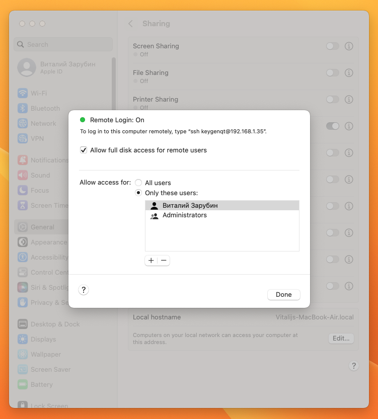
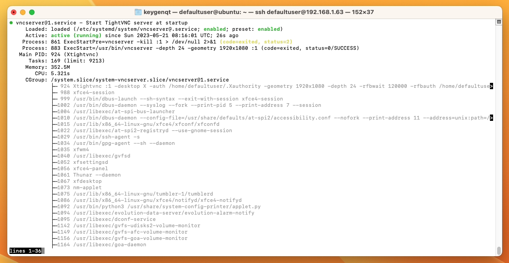
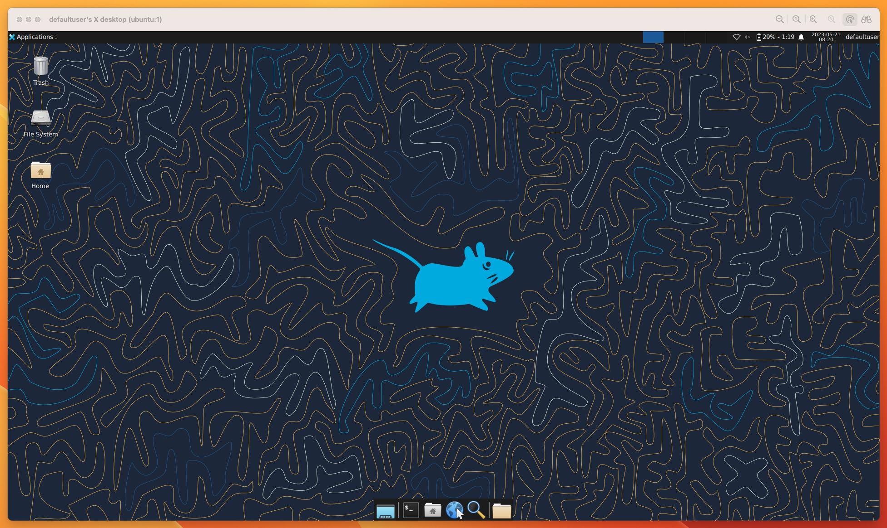
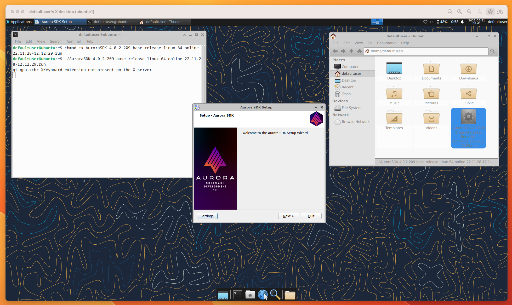
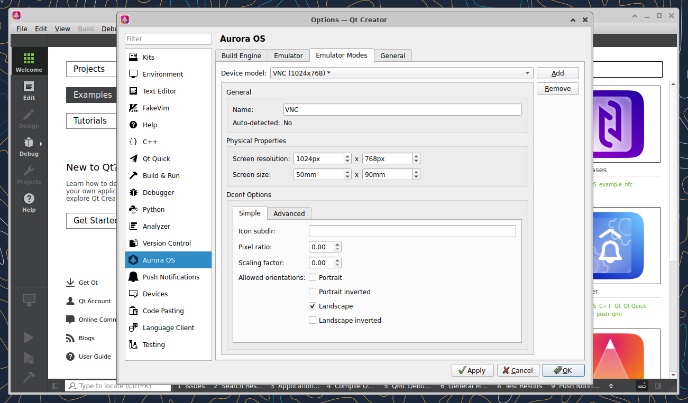
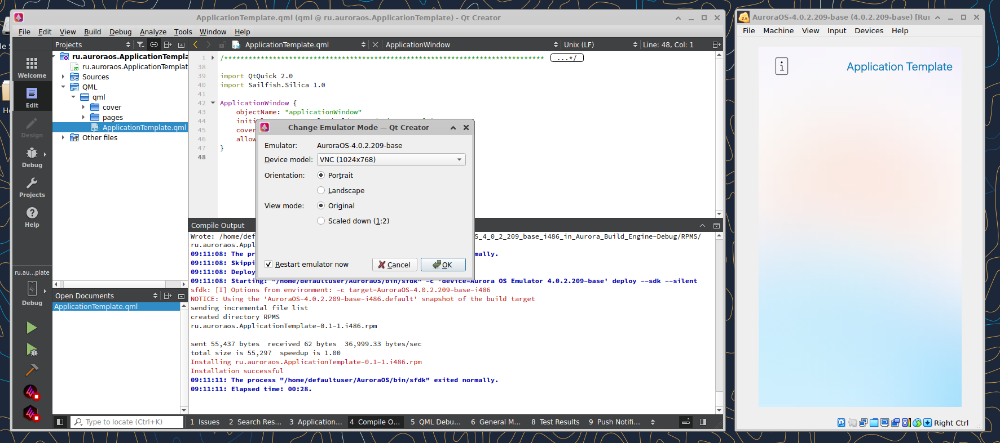
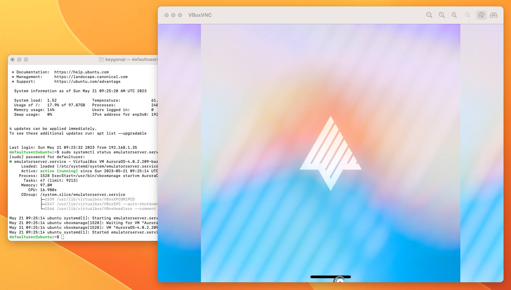

# Настройка удаленного сервера Aurora OS

Средства разработки Aurora OS не доступны для архитектуры arm.
Но есть большое желание работать на macOS M1/M2?
Мне удалось организовать удаленную работу с Aurora OS.
Работает это по локальной сети в связке с сервером на x86.
У многих есть старая железка на x86, она подойдет для этого и вам не придется на прямую работать на ней.

## Подготовка

В macOS нам нужно включить ssh и доступ к директориям.
Для этого перейдите в настройки General->Sharing активируйте `Remote Login`.
После этого включите `Allow full disk access for remote users`



Там же указан ваш IP и логин которые понадобится для ssh подключения.
У меня это `ssh keygenqt@192.168.1.35`.
Я бы рекомендовал зайти в настройки роутера и зафиксировать локальные IP, что бы они не менялись.

На машине x68 ставим `Ubuntu server 23.04` с `OpenSSH`.
Я бы рекомендовал экспериментировать с другими linux дистрибутивами (ну если есть желание, пожалуйста).
На Ubuntu 22.04 эмулятор мне завести нормально не удалось, на 23.04 все ок.
При установке я указал юзера `defaultuser`.
IP можно узнать установив `net-tools`

```shell
sudo apt install net-tools
```

и выполнив команду

```shell
ifconfig
```

Примерно это вы увидите на машине.
Я схалтурил, по ssh уже выполнил команду, вам это нужно будет сделать на машине.
Ну не фоточку же сюда крутить, скриншот красивше.
Не забудьте и этот фиксануть IP в роутере.


И того у нас должны быть "на руках":

* Включенный ssh на macOS
* Включенный `Allow full disk access for remote users` на macOS
* Машина x86 с установленной туда Ubuntu server 23.04
* Установленный OpenSSH на Ubuntu server

И данные которые нам понадобятся для настройки:

* IP macOS - у меня это `192.168.1.35`
* Login юзера - у меня это `keygenqt`
* IP macOS - у меня это `192.168.1.63`
* Login юзера - у меня это `defaultuser`
* Пароли к двум серверам - у меня это `the secret`

Можно приступать.

## SSH

Открываем на macOS Terminal.
Сервер с Ubuntu можно отложить, он нам доступен по ssh и больше физически не понадобится.
Первым делом нужно обменяться публичными ключами для доступа.

**_(команды я буду приводить исходя их своих данных, у вас они могут отличатся)_**

Создаем ключ на macOS:

```shell
ssh-keygen -t rsa
```

Добавляем ключ на сервер:

```shell
ssh-copy-id defaultuser@192.168.1.63
```

Теперь мы можем зайти на сервер без пароля:

```shell
ssh defaultuser@192.168.1.63
```

Создаем ключ на сервере:

```shell
ssh-keygen -t rsa
```

Добавляем ключ на macOS:

```shell
ssh-copy-id keygenqt@192.168.1.35
```

Этим мы убрали нужду вводить пароли каждый раз при доступе машин к друг другу.

## VNC Ubuntu server

И так у нас открыт в терминале на macOS сервер Ubuntu.
Если у вас ноут, и вы хотите его закрыть и закинуть на шкаф, это можно организовать.
Для того что бы Ubuntu не уходила в `sleep` добавьте в `/etc/systemd/logind.conf` строчку `HandleLidSwitch=ignore`

```shell
echo 'HandleLidSwitch=ignore' | sudo tee -a /etc/systemd/logind.conf

sudo systemctl mask sleep.target suspend.target hibernate.target hybrid-sleep.target
```

Для установки Аврора SDK в котором есть нужный нам эмулятор потребуется графический интерфейс.
А так как мы ленивые и не хотим вставать из за стола, подключать к серверу монитор, лезть на пыльный шкаф, и ставить все на машине, сделаем это через VNC и ssh.

Установим на сервер: Xfce:

```shell
sudo apt install -y xfce4 xfce4-goodies
```

Установим VNC сервер, фейковый монитор, и нужные зависимости.

```shell
sudo apt install -y tightvncserver xserver-xorg-video-dummy dbus-x11 bzip2
```

Добавим настройки фейкового монитора:

```shell
read -r -d '' conf <<-EOF
Section "Device"
    Identifier  "Configured Video Device"
    Driver      "dummy"
EndSection

Section "Monitor"
    Identifier  "Configured Monitor"
    HorizSync 31.5-48.5
    VertRefresh 50-70
EndSection

Section "Screen"
    Identifier  "Default Screen"
    Monitor     "Configured Monitor"
    Device      "Configured Video Device"
    DefaultDepth 24
    SubSection "Display"
    Depth 24
    Modes "1920x1080"
    EndSubSection
EndSection
EOF

echo "$conf" | sudo tee -a /usr/share/X11/xorg.conf.d/xorg.conf
```

Настроим пароль VNC сервера:

```shell
vncserver
```

Добавим кофиг xstartup:

```shell
read -r -d '' conf <<-EOF
#!/bin/bash
xrdb $HOME/.Xresources
startxfce4 &
EOF

echo "$conf" > ~/.vnc/xstartup

chmod +x ~/.vnc/xstartup
```

Добавим конфиг systemd сервиса который будет запускать VNC сервер при старте машины:

```shell
read -r -d '' conf <<-EOF
[Unit]
Description=Start TightVNC server at startup
After=syslog.target network.target

[Service]
Type=forking
User=defaultuser
Group=defaultuser
WorkingDirectory=/home/defaultuser

PIDFile=/home/defaultuser/.vnc/%H:%i.pid
ExecStartPre=-vncserver -kill :%i > /dev/null 2>&1
ExecStart=/usr/bin/vncserver -depth 24 -geometry 1920x1080 :%i
ExecStop=/usr/bin/vncserver -kill :%i

[Install]
WantedBy=multi-user.target
EOF

echo "$conf" | sudo tee -a /etc/systemd/system/vncserver@.service

sudo systemctl daemon-reload

sudo systemctl enable vncserver@1.service
```

Перезапускаем машину и можно проверить все ли ок с сервисом:

```shell
sudo reboot

ssh defaultuser@192.168.1.63

sudo systemctl status vncserver@1.service
```



Теперь переходим в Safari и в url пишем: `vnc://192.168.1.63:5901`



## Установка Аврора SDK

Теперь нужно уставить SDK.
Качаем его в терминале сервера с Ubuntu:

```shell
wget https://sdk-repo.omprussia.ru/sdk/installers/4.0.2/AppSDK/4.0.2.209/AuroraSDK-4.0.2.209-base-release-linux-64-online-22.11.28-12.12.29.run
```

Для установки нам потребуется VirtualBox, установим его:

```shell
sudo apt install -y virtualbox virtualbox-ext-pack
```

Можно приступать к установке Аврора SDK по VNC.
Здесь ничего сложного запускаем скачанный *.run.
Выбираем VirtualBox когда спросят и далее, далее, далее...

```shell
chmod +x AuroraSDK-4.0.2.209-base-release-linux-64-online-22.11.28-12.12.29.run
./AuroraSDK-4.0.2.209-base-release-linux-64-online-22.11.28-12.12.29.run
```



## Настройка VNC эмулятора

Теперь мы можем настроить VNC для эмулятора.
С настройками позиции эмулятора все сложно, я нашел режим который позволит адекватно его запустить по VNC.
Мы будем запускать VM в headless режиме и нам нужно что бы эмулятор не лежал на боку и вообще работал.
Нам нужно установить ему разрешение доступное для видео карты.
Для этого переходим в Aurora IDE.
В меню выбираем Tools -> Options... -> Aurora OS -> Emulator Modes
Создаем кастомную модификацию VM нажав Add.
Установим интересующие нас разрешение в привычном для видео карты формате и сохраняем:



 Теперь нам нужно установить нашу модель эмулятора.
 В меню выбираем Tools -> Aurora OS -> Emulator Modes.
 Если у вас появится "Emulator is not Selected", просто соберите разок тестовый пример, IDE все настроит.



Далее нужно перейти в VirtualBox и включить в настройках эмулятора `Remote Display`.


После применения модификации и включения `Remote Display` можно закрывать IDE, Emulator и VNC и возвращаться назад в терминал macOS.
Скажем VB что мы желаем использовать VNC.

```shell
VBoxManage setproperty vrdeextpack VNC
```

Установим пароль для доступа по VNC к эмулятору:

```shell
VBoxManage modifyvm AuroraOS-4.0.2.209-base --vrdeproperty VNCPassword=00000
```

Добавим конфиг systemd сервиса который будет запускать VNC эмулятор при старте машины:

```shell
read -r -d '' conf <<-EOF
[Unit]
Description=VirtualBox VM AuroraOS-4.0.2.209-base
Requires=multi-user.target
After=multi-user.target
AllowIsolate=yes

[Service]
User=defaultuser
Group=defaultuser
Type=forking
Restart=no
TimeoutSec=5min
IgnoreSIGPIPE=no
KillMode=process
GuessMainPID=no
RemainAfterExit=yes
ExecStart=/usr/bin/vboxmanage startvm AuroraOS-4.0.2.209-base --type headless
ExecStop=/usr/bin/vboxmanage controlvm AuroraOS-4.0.2.209-base poweroff

[Install]
WantedBy=multi-user.target
EOF

echo "$conf" | sudo tee -a /etc/systemd/system/emulatorserver.service

sudo systemctl daemon-reload

sudo systemctl enable emulatorserver.service
```

Перезапускаем машину и можно проверить все ли ок с сервисом:

```shell
sudo reboot

ssh defaultuser@192.168.1.63

sudo systemctl status emulatorserver.service
```

Теперь переходим в Safari и в url пишем: `vnc://192.168.1.63:3389`



Края будут обрезанные, просто поставьте темную тему.
Баг известен, пофиксят.

## SSHFS

Для доступа к файловой системе с проектами установим на сервер Ubuntu SSHFS:

```shell
sudo apt install -y sshfs
```

Добавим разрешение:

```shell
echo 'user_allow_other' | sudo tee -a /etc/fuse.conf

sudo sshfs -o allow_other keygenqt@192.168.1.35:/Users/keygenqt/Documents/Projects ~/Projects
```

Добавим автоматическое монтирование в systemd:

```shell
read -r -d '' conf <<-EOF
[Unit]
Description=Mount my remote filesystem over sshfs with fuse
After=network.target
After=tailscaled.service

[Install]
WantedBy=multi-user.target

[Mount]
What=keygenqt@192.168.1.35:/Users/keygenqt/Documents/Projects
Where=/home/defaultuser/Projects/
Type=fuse.sshfs
Options=allow_other,noatime,port=22,IdentityFile=/home/defaultuser/.ssh/id_rsa
EOF

echo "$conf" | sudo tee -a /etc/systemd/system/home-defaultuser-Projects.mount

sudo systemctl daemon-reload

sudo systemctl enable home-defaultuser-Projects.mount
```

Перезапускаем машину и можно проверить все ли ок с сервисом:

```shell
sudo reboot

ssh defaultuser@192.168.1.63

sudo systemctl status home-defaultuser-Projects.mount
```

Теперь у вас примонтирована папка с проектами в системе Ubuntu.

## Aurora Platform SDK

Для сборки проектов поставим `Aurora Platform SDK`.
На сервере Ubuntu скачаем нужные пакеты:

```shell
wget https://sdk-repo.omprussia.ru/sdk/installers/4.0.2/PlatformSDK/4.0.2.209/Aurora_OS-4.0.2.209-base-Aurora_Platform_SDK_Chroot-i486.tar.bz2
wget https://sdk-repo.omprussia.ru/sdk/installers/4.0.2/PlatformSDK/4.0.2.209/Aurora_OS-4.0.2.209-base-Aurora_SDK_Tooling-i486.tar.bz2
wget https://sdk-repo.omprussia.ru/sdk/installers/4.0.2/PlatformSDK/4.0.2.209/Aurora_OS-4.0.2.209-base-Aurora_SDK_Target-i486.tar.bz2
wget https://sdk-repo.omprussia.ru/sdk/installers/4.0.2/PlatformSDK/4.0.2.209/Aurora_OS-4.0.2.209-base-Aurora_SDK_Target-armv7hl.tar.bz2
```

Устанавливаем:

```shell
mkdir -pv ~/AuroraPlatformSDK/sdks/aurora_psdk

echo 'export PSDK_DIR=~/AuroraPlatformSDK/sdks/aurora_psdk' >> ~/.bashrc

echo 'PS1="[AuroraPlatformSDK]$ "' > ~/.mersdk.profile

exec bash

sudo tar --numeric-owner -p -xjf ./Aurora_OS-4.0.2.209-base-Aurora_Platform_SDK_Chroot-i486.tar.bz2 --checkpoint=.1000 -C $PSDK_DIR

$PSDK_DIR/sdk-chroot sdk-assistant tooling create \
Aurora_OS-4.0.2 \
./Aurora_OS-4.0.2.209-base-Aurora_SDK_Tooling-i486.tar.bz2

$PSDK_DIR/sdk-chroot sdk-assistant target create \
AuroraOS-4.0.2-i486 \
./Aurora_OS-4.0.2.209-base-Aurora_SDK_Target-i486.tar.bz2

$PSDK_DIR/sdk-chroot sdk-assistant target create \
AuroraOS-4.0.2-armv7hl \
./Aurora_OS-4.0.2.209-base-Aurora_SDK_Target-armv7hl.tar.bz2

rm Aurora_OS-4.0.2.209-base-Aurora_*

$PSDK_DIR/sdk-chroot sdk-assistant list
```

С настройкой сервера с Ubuntu закончили.
Теперь у нас есть все что нужно:

* VNC сервера
* VNC эмулятора
* Доступ к файловой системе macOS
* Aurora Platform SDK с помощью которой мы может собрать проекты Aurora OS

## Завершение

Сервер готов.
Осталось добавить пару-тройку скриптов на macOS для взаимодействия с сервером на которой Aurora на борту.
Я накидал 3 скрипта:

* build - сборка проекта
* install - установка RPM на эмулятор
* run - запуск приложения на эмуляторе

Выполняются они в директории проекта.
Установим скрипты:

```shell

```

В скриптах вам потребуется подправить 2 переменные, указать свои данные:

```shell
SERVER_USER='defaultuser'
SERVER_IP='192.168.1.63'
```

Поставим
